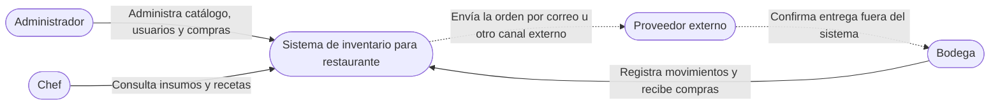

# C4 nivel 1 · Contexto

```mermaid
flowchart LR
  admin([Administrador])
  chef([Chef])
  bodega([Bodega])
  sistema([Sistema de inventario para restaurante])
  proveedor([Proveedor externo])
  admin -->|Administra catálogo, usuarios y compras| sistema
  chef -->|Consulta insumos y recetas| sistema
  bodega -->|Registra movimientos y recibe compras| sistema
  sistema -.->|Envía la orden por correo u otro canal externo| proveedor
  proveedor -.->|Confirma entrega fuera del sistema| bodega
```

El proveedor no tiene una cuenta ni una integración en el alcance actual. La orden se comunica externamente.
