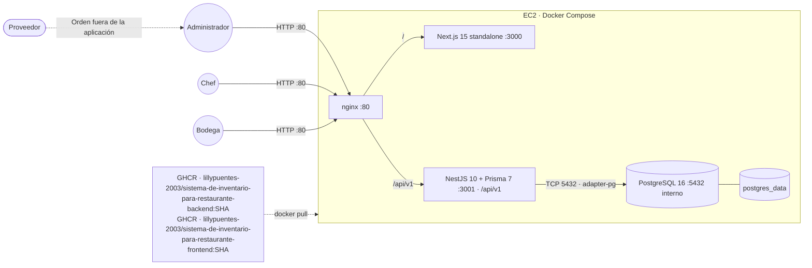

# C4 nivel 2 · Contenedores

```mermaid
flowchart LR
  admin((Administrador)) -->|HTTP :80| proxy
  chef((Chef)) -->|HTTP :80| proxy
  bodega((Bodega)) -->|HTTP :80| proxy
  subgraph ec2[EC2 · Docker Compose]
    proxy[nginx :80]
    front[Next.js 15 standalone :3000]
    back[NestJS 10 + Prisma 7 :3001 · /api/v1]
    db[(PostgreSQL 16 :5432 interno)]
    vol[(postgres_data)]
  end
  proxy -->|/| front
  proxy -->|/api/v1| back
  back -->|TCP 5432 · adapter-pg| db
  db --- vol
  ghcr[GHCR · lillypuentes-2003/sistema-de-inventario-para-restaurante-backend:SHA<br/>GHCR · lillypuentes-2003/sistema-de-inventario-para-restaurante-frontend:SHA]
  ghcr -.->|docker pull| ec2
  proveedor([Proveedor]) -.->|Orden fuera de la aplicación| admin
```

El proxy publica el puerto 80. PostgreSQL no publica el puerto 5432 en el host.
