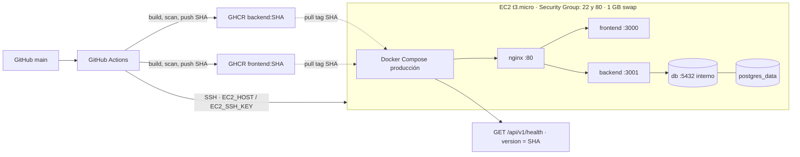
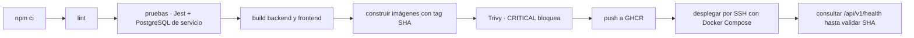

# Despliegue (Corte 3)

```mermaid
flowchart LR
  repo[GitHub main] --> actions[GitHub Actions]
  actions -->|build, scan, push SHA| backend[GHCR backend:SHA]
  actions -->|build, scan, push SHA| frontend[GHCR frontend:SHA]
  actions -->|SSH · EC2_HOST / EC2_SSH_KEY| ec2
  subgraph ec2[EC2 t3.micro · Security Group: 22 y 80 · 1 GB swap]
    compose[Docker Compose producción]
    proxy[nginx :80]
    front[frontend :3000]
    back[backend :3001]
    db[(db :5432 interno)]
    volume[(postgres_data)]
    compose --> proxy
    proxy --> front
    proxy --> back
    back --> db
    db --- volume
  end
  backend -.->|pull tag SHA| compose
  frontend -.->|pull tag SHA| compose
  compose --> health[GET /api/v1/health · version = SHA]
```

# Flujo del pipeline

```mermaid
flowchart LR
  ci[npm ci] --> lint[lint]
  lint --> test[pruebas · Jest + PostgreSQL de servicio]
  test --> build[build backend y frontend]
  build --> images[construir imágenes con tag SHA]
  images --> trivy[Trivy · CRITICAL bloquea]
  trivy --> push[push a GHCR]
  push --> ssh[desplegar por SSH con Docker Compose]
  ssh --> verify[consultar /api/v1/health hasta validar SHA]
```
